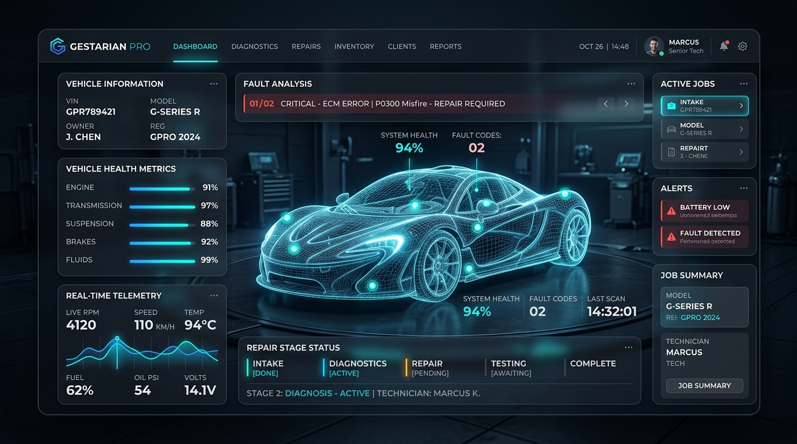

# GESTARIAN · Landing Page Oficial (www.gestarian.com)

> Página de inicio oficial y portal de presentación del ecosistema **GESTARIAN**: El Sistema Operativo Inteligente para Talleres Mecánicos y Conductores.



---

## 🚀 Descripción del Proyecto

Esta landing page ha sido desarrollada con tecnologías web modernas, diseño cinemático de alto impacto estético automotriz y optimizaciones para conversión y fidelización:

- **Ecosistema Modular:**
  - **Gestarian Pro:** ERP integral para recepción, órdenes de trabajo, facturación VeriFactu y gestión de taller.
  - **Gestarian Connected:** Portal exclusivo para el cliente/conductor donde sigue en tiempo real las fases de reparación y aprueba presupuestos con 1 clic.
  - **Gestarian METIS AI:** Copiloto con Inteligencia Artificial que digitaliza fichas técnicas y permisos de circulación por OCR en 0.5s y asiste en diagnósticos mecánicos.
  - **Gestarian Enterprise:** Para redes de talleres, franquicias y flotas con analítica consolidada multisede.

---

## ✨ Características Técnicas y Animaciones

- **Animación Mobile & Tablet Portrait (Especificación estricta):**
  - El título inicial y subtítulo hero aparecen desde 150px más abajo con fade-in, sobrepasan 20px su posición final (`translateY(-20px)`) y luego descienden esos 20px con efecto rebote suave.
  - Todas las tarjetas de versiones tienen la misma animación coordinada con el scroll descendente: emergen desde 150px, sobrepasan 20px arriba, alcanzan su ubicación final con el fade-in al 70% y terminan al 100% de opacidad cuando quedan estáticas.
- **Simulador Interactivo del Portal del Conductor:** Permite probar en vivo con matrículas (`4521-KRT`, `8812-MNP`, `0194-LVC`), visualizar el stepper de avance de taller y aprobar presupuestos en 1 clic.
- **Calculadora de Rentabilidad (ROI) Dinámica:** Estimación en tiempo real del incremento de facturación y horas ahorradas al mes según el volumen de vehículos y ticket medio.
- **Selector de Planes y Tarifas:** Conmutador mensual/anual con cálculo automático de ahorro del 20%.
- **Formulario de Captura de Clientes Potenciales (Leads):** Modal accesible con confirmación inmediata y notificaciones Toast flotantes.
- **Zero Dependencies / Ultra Fast:** HTML5 semántico puro, CSS moderno con variables y Vanilla JS con `IntersectionObserver` de alto rendimiento.

---

## 🛠️ Estructura del Repositorio

```text
landing-page/
├── index.html              # Estructura semántica completa y SEO
├── styles.css              # Sistema de diseño, glassmorphism y keyframes
├── app.js                  # Lógica interactiva, simulador, calculadora y scroll observer
├── assets/
│   └── images/
│       ├── hero-dashboard.jpg  # Mockup 8k de Gestarian Pro
│       ├── client-portal.jpg   # Mockup 3D del Portal del Conductor
│       └── metis-ai.jpg        # Visualización de IA METIS y diagnóstico
└── README.md               # Documentación del proyecto
```

---

## 🌐 Despliegue y Visualización Local

Para visualizar la landing page en local:

1. **Apertura directa:**
   Abre [index.html](file:///C:/Users/Usuario/.gemini/antigravity-ide/scratch/landing-page/index.html) directamente con cualquier navegador moderno (Chrome, Edge, Safari, Firefox).

2. **Servidor local (opcional con npx):**
   ```bash
   npx serve .
   ```

---

© 2026 GESTARIAN AUTOMOTIVE SOLUTIONS S.L. · [www.gestarian.com](https://www.gestarian.com)
